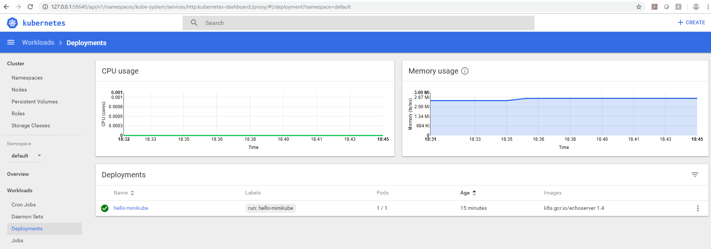

# Kubectl Basics

## What is kubectl

* provides access to local and remote clusters
* Primary gateway to interacting with any kubernetes clusters.
* primary command line access tool
* It is used to add pods and services, perform rolling updates, and much more.
* Nearly everyone who interacts with Kubernetes will use kubectl


## Commands

```Powershell
PS C:\WINDOWS\system32> kubectl cluster-info
Kubernetes master is running at https://172.168.100.16:8443
KubeDNS is running at https://172.168.100.16:8443/api/v1/namespaces/kube-system/services/kube-dns:dns/proxy
 
To further debug and diagnose cluster problems, use 'kubectl cluster-info dump'.
```

```Powershell
PS C:\WINDOWS\system32> kubectl get pods -n kube-system
NAME                               READY     STATUS    RESTARTS   AGE
coredns-86c58d9df4-d9g94           1/1       Running   0          3m
coredns-86c58d9df4-r7fwq           1/1       Running   0          3m
etcd-minikube                      1/1       Running   0          2m
kube-addon-manager-minikube        1/1       Running   0          2m
kube-apiserver-minikube            1/1       Running   0          2m
kube-controller-manager-minikube   1/1       Running   0          2m
kube-proxy-qp8xk                   1/1       Running   0          3m
kube-scheduler-minikube            1/1       Running   0          2m
storage-provisioner                1/1       Running   0          3m
```

```Powershell
PS C:\WINDOWS\system32> kubectl config current-context
minikube
```


```Powershell
PS C:\WINDOWS\system32> kubectl api-versions
admissionregistration.k8s.io/v1beta1
apiextensions.k8s.io/v1beta1
apiregistration.k8s.io/v1
apiregistration.k8s.io/v1beta1
apps/v1
apps/v1beta1
apps/v1beta2
authentication.k8s.io/v1
authentication.k8s.io/v1beta1
authorization.k8s.io/v1
authorization.k8s.io/v1beta1
autoscaling/v1
autoscaling/v2beta1
autoscaling/v2beta2
batch/v1
batch/v1beta1
certificates.k8s.io/v1beta1
coordination.k8s.io/v1beta1
events.k8s.io/v1beta1
extensions/v1beta1
networking.k8s.io/v1
policy/v1beta1
rbac.authorization.k8s.io/v1
rbac.authorization.k8s.io/v1beta1
scheduling.k8s.io/v1beta1
storage.k8s.io/v1
storage.k8s.io/v1beta1
v1

```

```Powershell

PS D:\practices\kubernetes\basic> kubectl get nodes
NAME       STATUS    ROLES     AGE       VERSION
minikube   Ready     master    5h        v1.13.2
```

```Powershell
PS D:\practices\kubernetes\basic> kubectl describe nodes minikube
```
**Output**
```Powershell
Name:               minikube
Roles:              master
Labels:             beta.kubernetes.io/arch=amd64
                    beta.kubernetes.io/os=linux
                    kubernetes.io/hostname=minikube
                    node-role.kubernetes.io/master=
Annotations:        kubeadm.alpha.kubernetes.io/cri-socket=/var/run/dockershim.sock
                    node.alpha.kubernetes.io/ttl=0
                    volumes.kubernetes.io/controller-managed-attach-detach=true
CreationTimestamp:  Sat, 09 Feb 2019 17:20:34 +0530
Taints:             <none>
Unschedulable:      false
Conditions:
  Type             Status  LastHeartbeatTime                 LastTransitionTime                Reason                       Message
  ----             ------  -----------------                 ------------------                ------                       -------
  MemoryPressure   False   Sat, 09 Feb 2019 22:42:54 +0530   Sat, 09 Feb 2019 17:20:22 +0530   KubeletHasSufficientMemory   kubelet has sufficient memory available
  DiskPressure     False   Sat, 09 Feb 2019 22:42:54 +0530   Sat, 09 Feb 2019 17:20:22 +0530   KubeletHasNoDiskPressure     kubelet has no disk pressure
  PIDPressure      False   Sat, 09 Feb 2019 22:42:54 +0530   Sat, 09 Feb 2019 17:20:22 +0530   KubeletHasSufficientPID      kubelet has sufficient PID available
  Ready            True    Sat, 09 Feb 2019 22:42:54 +0530   Sat, 09 Feb 2019 17:20:22 +0530   KubeletReady                 kubelet is posting ready status
Addresses:
  InternalIP:  172.168.100.18
  Hostname:    minikube
Capacity:
 cpu:                2
 ephemeral-storage:  16888216Ki
 hugepages-2Mi:      0
 memory:             2027436Ki
 pods:               110
Allocatable:
 cpu:                2
 ephemeral-storage:  15564179840
 hugepages-2Mi:      0
 memory:             1725036Ki
 pods:               110
System Info:
 Machine ID:                 798f38eab3e14dfa948e6dee3b358e8b
 System UUID:                CE8414FB-AFD8-C543-A890-8C6D269F3268
 Boot ID:                    54f52cbc-d2b3-4cd8-8720-86df58aa878f
 Kernel Version:             4.15.0
 OS Image:                   Buildroot 2018.05
 Operating System:           linux
 Architecture:               amd64
 Container Runtime Version:  docker://18.6.1
 Kubelet Version:            v1.13.2
 Kube-Proxy Version:         v1.13.2
ExternalID:                  minikube
Non-terminated Pods:         (14 in total)
  Namespace                  Name                                    CPU Requests  CPU Limits  Memory Requests  Memory Limits
  ---------                  ----                                    ------------  ----------  ---------------  -------------
  default                    hello-minikube-5c856cbf98-xwxnm         0 (0%)        0 (0%)      0 (0%)           0 (0%)
  default                    tomcat-deployment-5c4b9b9c99-cfzlr      0 (0%)        0 (0%)      0 (0%)           0 (0%)
  kube-system                coredns-86c58d9df4-6kjwf                100m (5%)     0 (0%)      70Mi (3%)        170Mi (9%)
  kube-system                coredns-86c58d9df4-d2q5b                100m (5%)     0 (0%)      70Mi (3%)        170Mi (9%)
  kube-system                etcd-minikube                           0 (0%)        0 (0%)      0 (0%)           0 (0%)
  kube-system                heapster-sgb6s                          0 (0%)        0 (0%)      0 (0%)           0 (0%)
  kube-system                influxdb-grafana-j9r8d                  0 (0%)        0 (0%)      0 (0%)           0 (0%)
  kube-system                kube-addon-manager-minikube             5m (0%)       0 (0%)      50Mi (2%)        0 (0%)
  kube-system                kube-apiserver-minikube                 250m (12%)    0 (0%)      0 (0%)           0 (0%)
  kube-system                kube-controller-manager-minikube        200m (10%)    0 (0%)      0 (0%)           0 (0%)
  kube-system                kube-proxy-fmqkg                        0 (0%)        0 (0%)      0 (0%)           0 (0%)
  kube-system                kube-scheduler-minikube                 100m (5%)     0 (0%)      0 (0%)           0 (0%)
  kube-system                kubernetes-dashboard-ccc79bfc9-7vhnx    0 (0%)        0 (0%)      0 (0%)           0 (0%)
  kube-system                storage-provisioner                     0 (0%)        0 (0%)      0 (0%)           0 (0%)
Allocated resources:
  (Total limits may be over 100 percent, i.e., overcommitted.)
  CPU Requests  CPU Limits  Memory Requests  Memory Limits
  ------------  ----------  ---------------  -------------
  755m (37%)    0 (0%)      190Mi (10%)      340Mi (18%)
Events:         <none>
```

```Powershell
PS D:\practices\kubernetes\basic> kubectl get daemonSets
No resources found.
```

```Powershell
PS D:\practices\kubernetes\basic> kubectl get deployments
NAME                DESIRED   CURRENT   UP-TO-DATE   AVAILABLE   AGE
hello-minikube      1         1         1            1           4h
tomcat-deployment   1         1         1            1           3h
```

```Powershell
PS D:\practices\kubernetes\basic> kubectl get services
NAME                TYPE        CLUSTER-IP      EXTERNAL-IP   PORT(S)          AGE
hello-minikube      NodePort    10.99.120.154   <none>        8080:32169/TCP   4h
kubernetes          ClusterIP   10.96.0.1       <none>        443/TCP          5h
tomcat-deployment   NodePort    10.111.1.164    <none>        8080:30104/TCP   3h
```

```Powershell
PS D:\practices\kubernetes\basic> kubectl proxy
Starting to serve on 127.0.0.1:8001
```

```Powershell
PS C:\Users\nadeemoh.ORADEV> curl http://127.0.0.1:8001/
 
 
StatusCode        : 200
StatusDescription : OK
Content           : {
                      "paths": [
                        "/api",
                        "/api/v1",
                        "/apis",
                        "/apis/",
                        "/apis/admissionregistration.k8s.io",
                        "/apis/admissionregistration.k8s.io/v1beta1",
                        "/apis/apiextensions.k8s.io",
                        "...
RawContent        : HTTP/1.1 200 OK
                    Content-Length: 2647
                    Content-Type: application/json
                    Date: Sat, 09 Feb 2019 17:14:55 GMT
 
                    {
                      "paths": [
                        "/api",
                        "/api/v1",
                        "/apis",
                        "/apis/",
                        "/apis/admissionr...
Forms             : {}
Headers           : {[Content-Length, 2647], [Content-Type, application/json], [Date, Sat, 09 Feb 2019 17:14:55 GMT]}
Images            : {}
InputFields       : {}
Links             : {}
ParsedHtml        : mshtml.HTMLDocumentClass
RawContentLength  : 2647
```

### For Any issues
```Powershell
minikube delete
delete $HOME\.minikube
```
## Deploying Services

```Powershell
PS C:\WINDOWS\system32> kubectl run hello-minikube --image=k8s.gcr.io/echoserver:1.4 --port 8080
deployment.apps "hello-minikube" created
```

```Powershell
PS C:\WINDOWS\system32> kubectl expose deployment hello-minikube --type=NodePort
service "hello-minikube" exposed
```

```Powershell
PS C:\WINDOWS\system32> kubectl get services
NAME             TYPE        CLUSTER-IP      EXTERNAL-IP   PORT(S)          AGE
hello-minikube   NodePort    10.99.120.154   <none>        8080:32169/TCP   10s
kubernetes       ClusterIP   10.96.0.1       <none>        443/TCP          1h
```

```Powershell
PS C:\WINDOWS\system32> kubectl get deploy
NAME             DESIRED   CURRENT   UP-TO-DATE   AVAILABLE   AGE
hello-minikube   1         1         1            1           1m

```

```Powershell
PS C:\WINDOWS\system32> kubectl get pod
NAME                              READY     STATUS    RESTARTS   AGE
hello-minikube-5c856cbf98-xwxnm   1/1       Running   0          1m

```

```Powershell
PS C:\WINDOWS\system32> kubectl describe service hello-minikube
Name:                     hello-minikube
Namespace:                default
Labels:                   run=hello-minikube
Annotations:              <none>
Selector:                 run=hello-minikube
Type:                     NodePort
IP:                       10.99.120.154
Port:                     <unset>  8080/TCP
TargetPort:               8080/TCP
NodePort:                 <unset>  32169/TCP
Endpoints:                172.17.0.7:8080
Session Affinity:         None
External Traffic Policy:  Cluster
Events:                   <none>
```

```Powershell
PS C:\WINDOWS\system32> kubectl get svc hello-minikube
NAME             TYPE       CLUSTER-IP      EXTERNAL-IP   PORT(S)          AGE
hello-minikube   NodePort   10.99.120.154   <none>        8080:32169/TCP   1m

```

```Powershell
PS C:\WINDOWS\system32> minikube ip
172.168.100.18
```

```Powershell
PS C:\WINDOWS\system32> minikube service hello-minikube --url
http://172.168.100.18:32169
```

```Powershell
PS C:\WINDOWS\system32> curl http://172.168.100.18:32169
```
**Output**
```Powershell
StatusCode        : 200
StatusDescription : OK
Content           : CLIENT VALUES:
                    client_address=172.17.0.1
                    command=GET
                    real path=/
                    query=nil
                    request_version=1.1
                    request_uri=http://172.168.100.18:8080/
 
                    SERVER VALUES:
                    server_version=nginx: 1.10.0 - lua: 10001
 
                    HEADER...
RawContent        : HTTP/1.1 200 OK
                    Transfer-Encoding: chunked
                    Connection: keep-alive
                    Content-Type: text/plain
                    Date: Sat, 09 Feb 2019 13:06:19 GMT
                    Server: nginx/1.10.0
 
                    CLIENT VALUES:
                    client_address=172.17.0.1
                    com...
Forms             : {}
Headers           : {[Transfer-Encoding, chunked], [Connection, keep-alive], [Content-Type, text/plain], [Date, Sat, 09 Feb 2019 13:06:19 GMT]...}
Images            : {}
InputFields       : {}
Links             : {}
ParsedHtml        : mshtml.HTMLDocumentClass
RawContentLength  : 378
```

```Powershell
PS C:\WINDOWS\system32> minikube dashboard --url
Enabling dashboard ...
Verifying dashboard health ...
Launching proxy ...
Verifying proxy health ...
http://127.0.0.1:58640/api/v1/namespaces/kube-system/services/http:kubernetes-dashboard:/proxy/
```



## Cleaning Up

```Powershell
PS D:\practices\kubernetes\basic> kubectl delete services hello-minikube
service "hello-minikube" deleted
PS D:\practices\kubernetes\basic> kubectl delete deployment hello-minikube
deployment.extensions "hello-minikube" deleted
```

```Powershell
PS D:\practices\kubernetes\basic> minikube docker-env
$Env:DOCKER_TLS_VERIFY = "1"
$Env:DOCKER_HOST = "tcp://172.168.100.18:2376"
$Env:DOCKER_CERT_PATH = "C:\Users\nadeemoh.ORADEV\.minikube\certs"
$Env:DOCKER_API_VERSION = "1.35"
# Run this command to configure your shell:
# & minikube docker-env | Invoke-Expression
```


```Powershell
PS D:\practices\kubernetes\basic> docker info
Containers: 5
 Running: 0
 Paused: 0
 Stopped: 5
Images: 1
Server Version: 18.09.1
Storage Driver: overlay2
 Backing Filesystem: extfs
 Supports d_type: true
 Native Overlay Diff: true
Logging Driver: json-file
Cgroup Driver: cgroupfs
Plugins:
 Volume: local
 Network: bridge host macvlan null overlay
 Log: awslogs fluentd gcplogs gelf journald json-file local logentries splunk syslog
Swarm: inactive
Runtimes: runc
Default Runtime: runc
Init Binary: docker-init
containerd version: 9754871865f7fe2f4e74d43e2fc7ccd237edcbce
runc version: 96ec2177ae841256168fcf76954f7177af9446eb
init version: fec3683
Security Options:
 seccomp
  Profile: default
Kernel Version: 4.9.125-linuxkit
Operating System: Docker for Windows
OSType: linux
Architecture: x86_64
CPUs: 2
Total Memory: 1.934GiB
Name: linuxkit-00155d862108
ID: KAHM:YLFZ:X75N:6A2Q:5SVR:RH7Z:A562:3Z6Z:TKBO:YLRX:AN4C:YQBQ
Docker Root Dir: /var/lib/docker
Debug Mode (client): false
Debug Mode (server): true
 File Descriptors: 22
 Goroutines: 47
 System Time: 2019-02-10T04:17:47.3277649Z
 EventsListeners: 1
Registry: https://index.docker.io/v1/
Labels:
Experimental: false
Insecure Registries:
 127.0.0.0/8
Live Restore Enabled: false
Product License: Community Engine
 
PS D:\practices\kubernetes\basic>
```

# References
* [Kubectl Overview](https://kubernetes.io/docs/reference/kubectl/overview/)
* [Kubectl cheetsheet](https://kubernetes.io/docs/reference/kubectl/cheatsheet/)