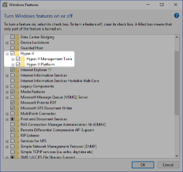

# Minikube Installation


# What is Minikube

* An All in one installation for minikube
* Takes all the components of kubernetes and package them into a single virtual machine to run locally
* Minikube requires virtualization
* It is great for training development and learning

# Windows 

## Prerequisites 

### Hypervisor 

Make sure Hypervisor is installed 



## Package manager for windows
Install [choco](https://chocolatey.org/docs/installation)

## Installation

```Powershell
PS C:\WINDOWS\system32> choco install minikube kubernetes-cli
Chocolatey v0.10.11
Installing the following packages:
minikube;kubernetes-cli
By installing you accept licenses for the packages.
minikube v0.33.1 already installed.
 Use --force to reinstall, specify a version to install, or try upgrade.
kubernetes-cli v1.13.3 already installed.
 Use --force to reinstall, specify a version to install, or try upgrade.
 
Chocolatey installed 0/2 packages.
 See the log for details (C:\ProgramData\chocolatey\logs\chocolatey.log).
 
Warnings:
 - kubernetes-cli - kubernetes-cli v1.13.3 already installed.
 Use --force to reinstall, specify a version to install, or try upgrade.
 - minikube - minikube v0.33.1 already installed.
 Use --force to reinstall, specify a version to install, or try upgrade.
PS C:\WINDOWS\system32>
```


```Powershell
PS C:\WINDOWS\system32> minikube version
minikube version: v0.33.1
PS C:\WINDOWS\system32>
```

```Powershell
PS C:\WINDOWS\system32> kubectl version
Client Version: version.Info{Major:"1", Minor:"10", GitVersion:"v1.10.11", GitCommit:"637c7e288581ee40ab4ca210618a89a555b6e7e9", GitTreeState:"clean", BuildDate:"2018-11-26T14:38:32Z", GoVersion:"go1.9.3", Compiler:"gc", Platform:"windows/amd64"}
Unable to connect to the server: dial tcp 192.168.100.9:8443: connectex: A connection attempt failed because the connected party did not properly respond after a period of time, or established connection failed because connected host has failed to respond.
PS C:\WINDOWS\system32>
```

## MAC 

TODO