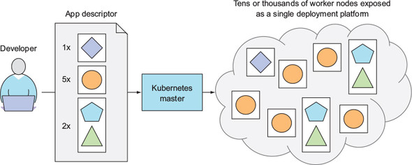
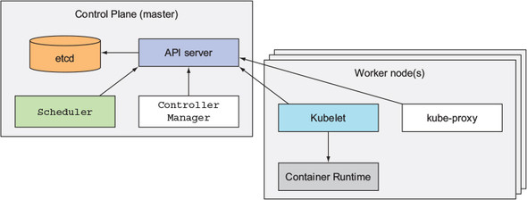
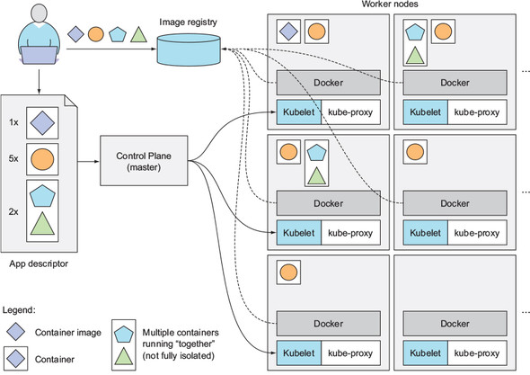
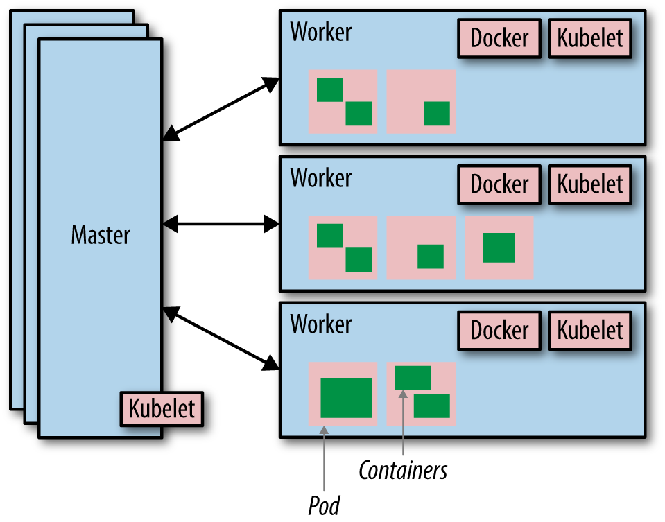

# Container Orchestration With Kubernetes

## Why Kubernetes
* Simplifying Application Deployment
* Achieving Better utilization of hardware.
* Health check and self healing
* Automatic scaling
* Recovery oriented, Crash only and micro services.

# References
* [Container Based Virtualization Using Docker]()
* [Kubernetes Playground]()
* [Kubernetes Playground 2]()
* [Kubernetes Basics]()

