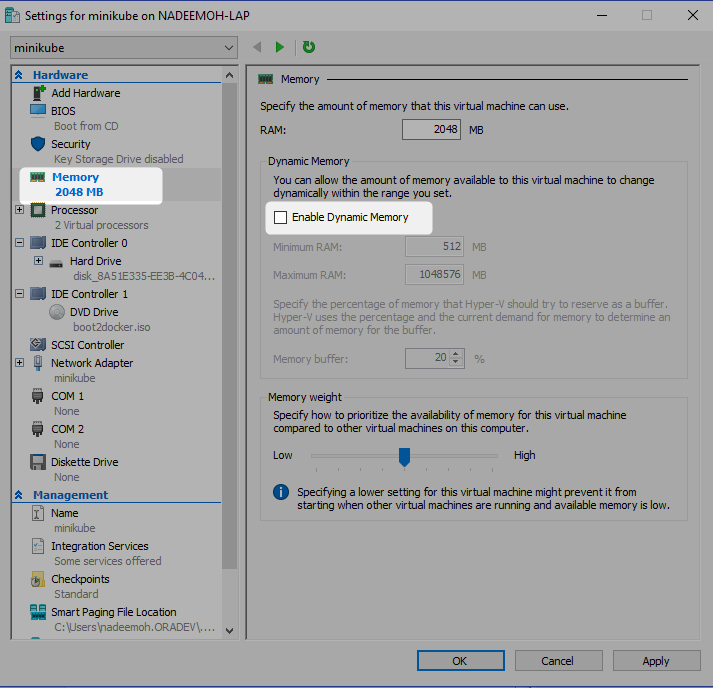

[Home](README.md)

# Starting Minkube


The following command would take 5 to 10 minutes

```Powershell
PS C:\WINDOWS\system32> minikube start --vm-driver="hyperv" --hyperv-virtual-switch="Primary Virtual Switch"
```
**Output**
```Powershell
PS C:\WINDOWS\system32> minikube start --vm-driver hyperv --hyperv-virtual-switch minikube
Starting local Kubernetes v1.13.2 cluster...
Starting VM...
Downloading Minikube ISO
 181.48 MB / 181.48 MB [============================================] 100.00% 0s
Getting VM IP address...
Moving files into cluster...
Downloading kubelet v1.13.2
Downloading kubeadm v1.13.2
Finished Downloading kubeadm v1.13.2
Finished Downloading kubelet v1.13.2
Setting up certs...
Connecting to cluster...
Setting up kubeconfig...
Stopping extra container runtimes...
Starting cluster components...
Verifying kubelet health ...
Verifying apiserver health ...
Kubectl is now configured to use the cluster.
Loading cached images from config file.
 
 
Everything looks great. Please enjoy minikube!
```


```Powershell
PS C:\WINDOWS\system32> minikube version
minikube version: v0.33.1
```


```Powershell
PS C:\WINDOWS\system32> minikube status
host: Running
kubelet: Running
apiserver: Running
kubectl: Correctly Configured: pointing to minikube-vm at 172.168.100.18
```

What happens inside


Stop it and then


```Powershell
PS C:\WINDOWS\system32> minikube addons list
- addon-manager: enabled
- dashboard: disabled
- default-storageclass: enabled
- efk: disabled
- freshpod: disabled
- gvisor: disabled
- heapster: disabled
- ingress: disabled
- kube-dns: disabled
- metrics-server: disabled
- nvidia-driver-installer: disabled
- nvidia-gpu-device-plugin: disabled
- registry: disabled
- registry-creds: disabled
- storage-provisioner: enabled
- storage-provisioner-gluster: disabled
```

```Powershell
PS C:\WINDOWS\system32> minikube status minikube service list
host: Running
kubelet: Running
apiserver: Running
kubectl: Correctly Configured: pointing to minikube-vm at 172.168.100.18
```
Enable for cluster performance monitoring


```Powershell
PS C:\WINDOWS\system32> minikube addons enable heapster
heapster was successfully enabled
```

```Powershell
PS C:\WINDOWS\system32> minikube dashboard
Enabling dashboard ...
Verifying dashboard health ...
Launching proxy ...
Verifying proxy health ...
Opening http://127.0.0.1:57902/api/v1/namespaces/kube-system/services/http:kubernetes-dashboard:/proxy/ in your default browser...
```


You can connect to vm

right click on the vm, click connect


docker/tcuser


```Powershell
PS C:\WINDOWS\system32> minikube ssh
                         _             _
            _         _ ( )           ( )
  ___ ___  (_)  ___  (_)| |/')  _   _ | |_      __
/' _ ` _ `\| |/' _ `\| || , <  ( ) ( )| '_`\  /'__`\
| ( ) ( ) || || ( ) || || |\`\ | (_) || |_) )(  ___/
(_) (_) (_)(_)(_) (_)(_)(_) (_)`\___/'(_,__/'`\____)
 
$ exit
logout
```

```Powershell

PS C:\WINDOWS\system32> minikube ip
172.168.100.18
```

# References
* [Docker machine](https://docs.docker.com/machine/get-started/)
* [Kubernetes local development](https://dzone.com/articles/kubernetes-local-development-with-minikube-on-hype)
* [minikube on windows](https://medium.com/@JockDaRock/minikube-on-windows-10-with-hyper-v-6ef0f4dc158c)
* [Running minikube](https://kubernetes.io/docs/setup/minikube/)


