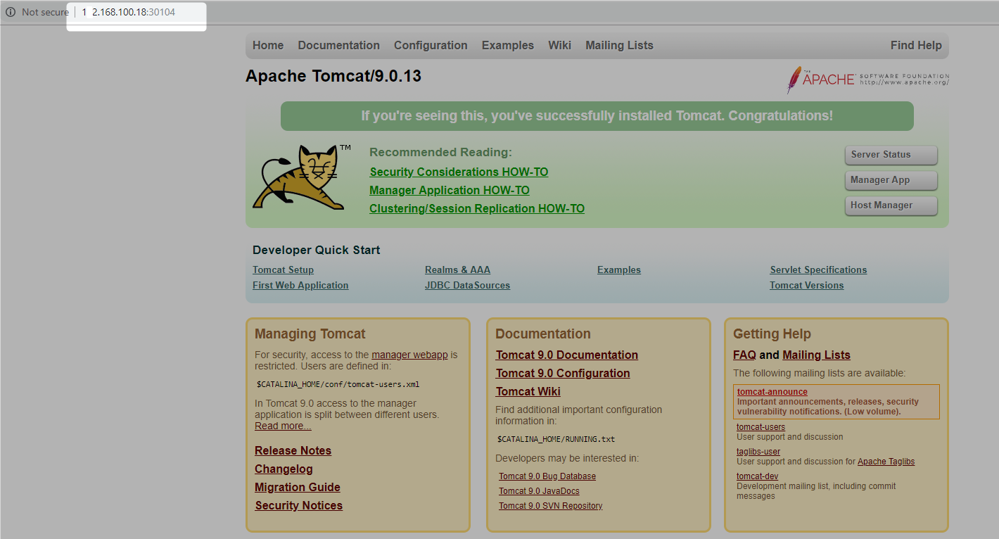

# Tomcat Deployment

**deployment.yaml** file
```Powershell
apiVersion: apps/v1beta2
kind: Deployment
metadata:
  name: tomcat-deployment
spec:
  selector:
    matchLabels:
      app: tomcat
  replicas: 1
  template:
    metadata:
      labels:
        app: tomcat
    spec:
      containers:
      - name: tomcat
        image: tomcat:9.0
        ports:
        - containerPort: 8080
```

```Powershell
PS D:\practices\kubernetes\basic> kubectl apply -f .\deployment.yaml
deployment.apps "tomcat-deployment" created
```

```Powershell
PS D:\practices\kubernetes\basic> kubectl expose deployment tomcat-deployment --type=NodePort
service "tomcat-deployment" exposed
```

```Powershell

PS D:\practices\kubernetes\basic> minikube service tomcat-deployment --url
http://172.168.100.18:30104
```



```Powershell
PS D:\practices\kubernetes\basic> kubectl get pod
NAME                                 READY     STATUS    RESTARTS   AGE
hello-minikube-5c856cbf98-xwxnm      1/1       Running   0          44m
tomcat-deployment-5c4b9b9c99-cfzlr   1/1       Running   0          16m

```

```Powershell
PS D:\practices\kubernetes\basic> kubectl get pods
NAME                                 READY     STATUS    RESTARTS   AGE
hello-minikube-5c856cbf98-xwxnm      1/1       Running   0          44m
tomcat-deployment-5c4b9b9c99-cfzlr   1/1       Running   0          16m
```

```Powershell
PS D:\practices\kubernetes\basic> kubectl get pods tomcat-deployment-5c4b9b9c99-cfzlr
NAME                                 READY     STATUS    RESTARTS   AGE
tomcat-deployment-5c4b9b9c99-cfzlr   1/1       Running   0          17m
```

```Powershell
PS D:\practices\kubernetes\basic> kubectl describe pod tomcat-deployment-5c4b9b9c99-cfzlr
Name:               tomcat-deployment-5c4b9b9c99-cfzlr
Namespace:          default
Priority:           0
PriorityClassName:  <none>
Node:               minikube/172.168.100.18
Start Time:         Sat, 09 Feb 2019 18:58:06 +0530
Labels:             app=tomcat
                    pod-template-hash=5c4b9b9c99
Annotations:        <none>
Status:             Running
IP:                 172.17.0.8
Controlled By:      ReplicaSet/tomcat-deployment-5c4b9b9c99
Containers:
  tomcat:
    Container ID:   docker://3c4753cea86f31552621fded6482e7dbdacec654d08c5987ec7fa1e99f5ad172
    Image:          tomcat:9.0
    Image ID:       docker-pullable://tomcat@sha256:3f4b2548996ffd6d7984f76557fc4db75f92e155340191f7a7325b1f751d10ac
    Port:           8080/TCP
    Host Port:      0/TCP
    State:          Running
      Started:      Sat, 09 Feb 2019 18:59:29 +0530
    Ready:          True
    Restart Count:  0
    Environment:    <none>
    Mounts:
      /var/run/secrets/kubernetes.io/serviceaccount from default-token-4c76r (ro)
Conditions:
  Type              Status
  Initialized       True
  Ready             True
  ContainersReady   True
  PodScheduled      True
Volumes:
  default-token-4c76r:
    Type:        Secret (a volume populated by a Secret)
    SecretName:  default-token-4c76r
    Optional:    false
QoS Class:       BestEffort
Node-Selectors:  <none>
Tolerations:     node.kubernetes.io/not-ready:NoExecute for 300s
                 node.kubernetes.io/unreachable:NoExecute for 300s
Events:
  Type    Reason     Age   From               Message
  ----    ------     ----  ----               -------
  Normal  Scheduled  18m   default-scheduler  Successfully assigned default/tomcat-deployment-5c4b9b9c99-cfzlr to minikube
  Normal  Pulling    18m   kubelet, minikube  pulling image "tomcat:9.0"
  Normal  Pulled     16m   kubelet, minikube  Successfully pulled image "tomcat:9.0"
  Normal  Created    16m   kubelet, minikube  Created container
  Normal  Started    16m   kubelet, minikube  Started container
```

```Powershell
PS D:\practices\kubernetes\basic> kubectl exec -it tomcat-deployment-5c4b9b9c99-cfzlr bash
root@tomcat-deployment-5c4b9b9c99-cfzlr:/usr/local/tomcat# ls
BUILDING.txt  CONTRIBUTING.md  LICENSE  NOTICE  README.md  RELEASE-NOTES  RUNNING.txt  bin  conf  include  lib  logs  native-jni-lib  temp  webapps  work
root@tomcat-deployment-5c4b9b9c99-cfzlr:/usr/local/tomcat# pwd
/usr/local/tomcat
root@tomcat-deployment-5c4b9b9c99-cfzlr:/usr/local/tomcat# exit
exit
PS D:\practices\kubernetes\basic>
```


# Scaling

```Powershell
PS C:\WINDOWS\system32>  kubectl get deployments
NAME                DESIRED   CURRENT   UP-TO-DATE   AVAILABLE   AGE
tomcat-deployment   1         1         1            1           7d
```

```Powershell
PS C:\WINDOWS\system32> kubectl get services
NAME                TYPE        CLUSTER-IP     EXTERNAL-IP   PORT(S)          AGE
kubernetes          ClusterIP   10.96.0.1      <none>        443/TCP          7d
tomcat-deployment   NodePort    10.111.1.164   <none>        8080:30104/TCP   7d

```

```Powershell
PS C:\WINDOWS\system32>  kubectl describe service tomcat-deployment
Name:                     tomcat-deployment
Namespace:                default
Labels:                   app=tomcat
Annotations:              <none>
Selector:                 app=tomcat
Type:                     NodePort
IP:                       10.111.1.164
Port:                     <unset>  8080/TCP
TargetPort:               8080/TCP
NodePort:                 <unset>  30104/TCP
Endpoints:                172.17.0.5:8080
Session Affinity:         None
External Traffic Policy:  Cluster
Events:                   <none>
```

```Powershell
PS C:\WINDOWS\system32> kubectl get svc tomcat-deployment
NAME                TYPE       CLUSTER-IP     EXTERNAL-IP   PORT(S)          AGE
tomcat-deployment   NodePort   10.111.1.164   <none>        8080:30104/TCP   7d
```
Increase replica
```Powershell
PS C:\WINDOWS\system32> kubectl scale --replicas=4 deployment/tomcat-deployment
deployment.extensions "tomcat-deployment" scaled
```

```Powershell
PS C:\WINDOWS\system32> kubectl get deployments
NAME                DESIRED   CURRENT   UP-TO-DATE   AVAILABLE   AGE
tomcat-deployment   4         4         4            4           7d
```

```Powershell
PS C:\WINDOWS\system32> kubectl describe deployment tomcat-deployment
Name:                   tomcat-deployment
Namespace:              default
CreationTimestamp:      Sat, 09 Feb 2019 18:58:06 +0530
Labels:                 <none>
Annotations:            deployment.kubernetes.io/revision=1
                        kubectl.kubernetes.io/last-applied-configuration={"apiVersion":"apps/v1beta2","kind":"Deployment","metadata":{"annotations":{},"name":"tomcat-deployment","namespace":"default"},"spec":{"replicas":1,"s...
Selector:               app=tomcat
Replicas:               4 desired | 4 updated | 4 total | 4 available | 0 unavailable
StrategyType:           RollingUpdate
MinReadySeconds:        0
RollingUpdateStrategy:  25% max unavailable, 25% max surge
Pod Template:
  Labels:  app=tomcat
  Containers:
   tomcat:
    Image:        tomcat:9.0
    Port:         8080/TCP
    Host Port:    0/TCP
    Environment:  <none>
    Mounts:       <none>
  Volumes:        <none>
Conditions:
  Type           Status  Reason
  ----           ------  ------
  Progressing    True    NewReplicaSetAvailable
  Available      True    MinimumReplicasAvailable
OldReplicaSets:  <none>
NewReplicaSet:   tomcat-deployment-5c4b9b9c99 (4/4 replicas created)
Events:
  Type    Reason             Age   From                   Message
  ----    ------             ----  ----                   -------
  Normal  ScalingReplicaSet  1m    deployment-controller  Scaled up replica set tomcat-deployment-5c4b9b9c99 to 4
```
Expose deployment
```Powershell
PS C:\WINDOWS\system32> kubectl expose deployment tomcat-deployment --type=LoadBalancer --port=8080 --target-port=8080 --name=tomcat-load-balancer
service "tomcat-load-balancer" exposed
PS C:\WINDOWS\system32>
```

```Powershell
PS C:\WINDOWS\system32> kubectl describe  service tomcat-load-balancer
Name:                     tomcat-load-balancer
Namespace:                default
Labels:                   app=tomcat
Annotations:              <none>
Selector:                 app=tomcat
Type:                     LoadBalancer
IP:                       10.103.8.39
Port:                     <unset>  8080/TCP
TargetPort:               8080/TCP
NodePort:                 <unset>  30394/TCP
Endpoints:                172.17.0.10:8080,172.17.0.5:8080,172.17.0.8:8080 + 1 more...
Session Affinity:         None
External Traffic Policy:  Cluster
Events:                   <none>
PS C:\WINDOWS\system32>
```


# Upgrading

```Powershell
PS C:\WINDOWS\system32> kubectl set image deployment/tomcat-deployment tomcat=tomcat:9.0.1
deployment.apps "tomcat-deployment" image updated

```

```Powershell
PS C:\WINDOWS\system32> kubectl rollout history deployment/tomcat-deployment
deployments "tomcat-deployment"
REVISION  CHANGE-CAUSE
1         <none>
2         <none>
```

```Powershell
PS C:\WINDOWS\system32> kubectl rollout history deployment/tomcat-deployment --revision=2
deployments "tomcat-deployment" with revision #2
Pod Template:
  Labels:       app=tomcat
        pod-template-hash=7cdfbd48d
  Containers:
   tomcat:
    Image:      tomcat:9.0.1
    Port:       8080/TCP
    Host Port:  0/TCP
    Environment:        <none>
    Mounts:     <none>
  Volumes:      <none>
 
PS C:\WINDOWS\system32>
```
